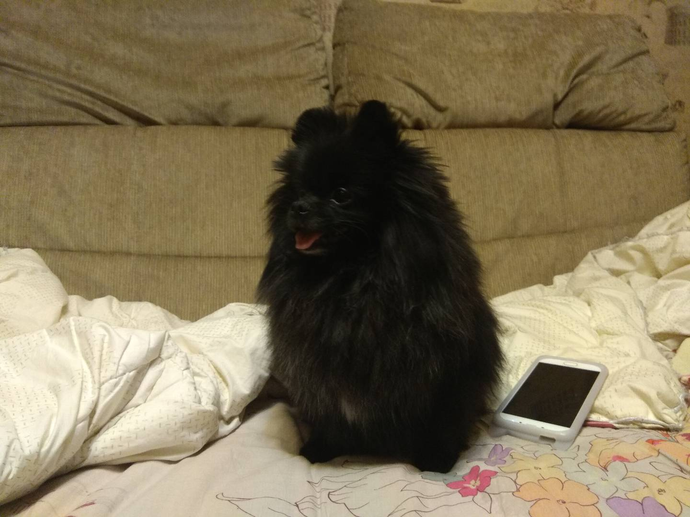

# Кашперский Владислав Станиславович

Я являюсь студентом Нетологии. Прохожу обучение по курсу "Андроид-разработчик".

Список навыков:
0. Умение расставлять приоритеты.
0. Умение работать в команде.
0. Способность к обучению.

